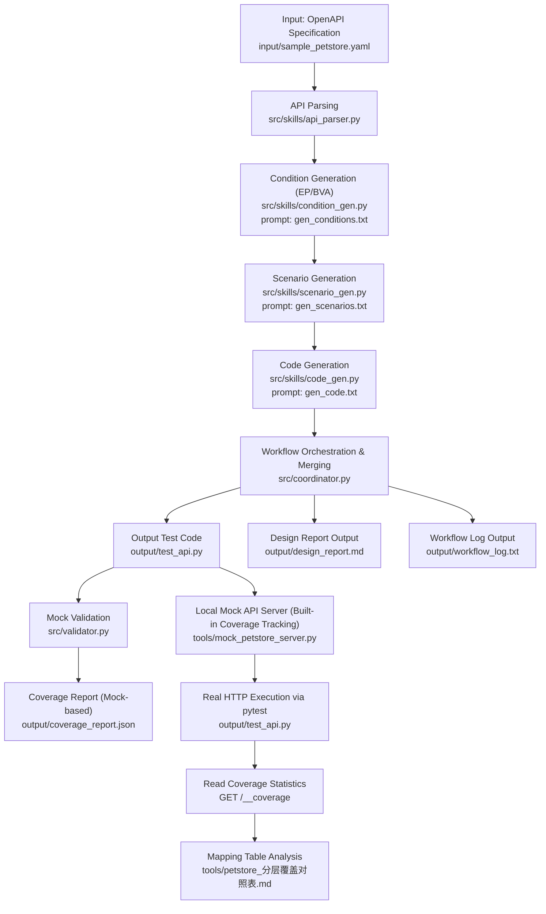

Title: LLM-Driven Black-Box Test Generation for REST APIs Based on OpenAPI, Equivalence Partitioning (EP), and Boundary Value Analysis (BVA)

---

# 1. Input Description

## 1.1 System Under Test (SUT)

The system under test is an HTTP REST API. The testing approach is black-box testing, with test design and validation based solely on the interface contract (OpenAPI 3.x specification).

## 1.2 Experimental Input

Input specification file: `input/sample_petstore.yaml`

Covered operations include:

- `GET /pets`
- `POST /pets`
- `GET /pets/{petId}`
- `DELETE /pets/{petId}`
- `POST /pets/{petId}/vaccinations`

---

# 2. Tool Artifacts and Workflow Description

## 2.1 Generation Workflow
This repository does not generate test code in a single pass. Instead, it follows a step-by-step pipeline:

OpenAPI Parsing Phase: Reads input/sample_petstore.yaml and extracts methods, path parameters, query parameters, request body fields, constraints, and response codes for each endpoint.
Condition Generation Phase (EP/BVA): Generates valid, invalid, and boundary conditions for individual endpoints, forming a structured conditions list.
Scenario Synthesis Phase: Combines conditions into executable test_cases. Each test case includes covered_condition_ids for subsequent coverage tracking.
Code Generation Phase: Generates pytest module code based on scenarios. Multi-endpoint results are merged by the coordinator into a single output/test_api.py.
Mock Validation Phase: Executes internal mock validation and writes results to output/coverage_report.json for design-side coverage statistics.
Real Execution Evaluation Phase (Mock-based Coverage Tracking): Starts tools/mock_petstore_server.py, runs python -m pytest output/test_api.py -v, reads coverage results via GET /__coverage, and maps them to tools/petstore_分层覆盖对照表.md for manual review.
Current evaluation partition logic:

Interface Partitioning (Operation Units): Divided into 5 operations by method + path (GET/POST /pets, GET/DELETE /pets/{petId}, POST /pets/{petId}/vaccinations).
Input Layering (EP + BVA): Includes type validity/invalidity, in-range/out-of-range values, boundary values, missing required fields, valid/invalid date formats, etc.
Output Layering (Status Codes): Partitioned by target status codes (success, parameter errors, resource not found, server errors).
Automated Statistics: Counts coverage by C-table condition IDs (C01..C47), excluding 500 conditions by default (C04/C08/C14/C18/C21/C25/C30/C35).
Manual Review: Reviews coverage status and uncovered items based on automated statistics and test case semantics.

## 2.2 Core Components
Project "tool artifacts" are organized into three categories: input, process, and output. Below describes the purpose and minimal usage examples for each.

Input Artifacts

input/sample_petstore.yaml: Source of the API contract under test.
Example: Extracts limit (1~100) and status (enum) constraints from GET /pets for subsequent EP/BVA condition generation.
src/prompts/gen_conditions.txt, src/prompts/gen_scenarios.txt, src/prompts/gen_code.txt: Three-stage prompt templates.
Example: gen_scenarios.txt enforces that each test case must include covered_condition_ids for coverage traceability.
Process Artifacts

src/skills/api_parser.py: Converts OpenAPI specifications into unified endpoint metadata structures.
Example: Parses POST /pets into an object containing method/path/parameters/requestBody/responses/constraints.
src/skills/condition_gen.py: Calls the LLM to generate condition lists.
Example: Generates valid, invalid, and boundary conditions for limit, such as 1, 100, 0, 101.
src/skills/scenario_gen.py: Combines conditions into executable test scenarios.
Example: Maps status_invalid_1 to a test case with expected_status=400 and records covered_condition_ids.
src/skills/code_gen.py: Converts scenario arrays into pytest code.
Example: Transforms test_cases into @pytest.mark.parametrize structures with unified make_request calls.
src/coordinator.py: Orchestrates endpoint loops, code merging, and report generation.
Example: Repeats the "conditions → scenarios → code" flow for 5 endpoints and merges them into one output/test_api.py.
src/validator.py: Performs mock validation and updates coverage state.
If a test fails, its associated condition IDs are removed from the "covered set."
Output Artifacts

output/test_api.py: Final executable test file.
Run directly with python -m pytest output/test_api.py -v to test the black-box content.
output/design_report.md: EP/BVA conditions and sample test case tables.
Facilitates viewing condition IDs, partition types, sample requests, and expected statuses by endpoint.
output/coverage_report.json: Mock validation-based coverage report.
Calculation: coverage_rate = validated_covered_count / total_conditions.
Here, total_conditions is the total number of conditions generated across all endpoints; validated_covered_count is the number of conditions still considered covered after mock validation.
The mock validation process writes generated code to a temporary pytest file, injects a make_request mock (which directly returns expected_status without accessing real services), executes pytest, collects failed tests, and maps failed tests back to their corresponding covered_condition_ids using parametrized test test_ids. Any condition ID mapped to a failed test is removed from the covered set and marked as "uncovered/invalid coverage."
This metric reflects whether "test design and generation logic are consistent and cover conditions," which is not equivalent to real API pass rates.
tools/petstore_分层覆盖对照表.md: Baseline table for input/output combination conditions in real execution contexts (including C-table C01..C47).
Execution: Start tools/mock_petstore_server.py, run python -m pytest output/test_api.py -v, then access GET /__coverage to retrieve coverage statistics.
Partitioning and calculation: The server automatically records coverage by C-table condition IDs; coverage rate is calculated after excluding 500 conditions.
Metric meaning: Represents "the proportion of testable conditions (excluding 500) hit during real HTTP round-trip execution."
output/workflow_log.txt: Pipeline log.
Helps identify which endpoint iteration experienced coverage drops or validation anomalies.

## 2.3 Model and Prompt Logic
Runtime Model Configuration (from .env)

LLM_BASE_URL=https://api.deepseek.com
LLM_MODEL=deepseek-chat
The project calls DeepSeek's DeepSeek-V3.2 model via an OpenAI-compatible interface.
Prompt Content and Logic (Excerpts)

gen_conditions.txt (Condition Generation)
Key constraints: Use ONLY parameters that appear in the specification, partition_type: valid|invalid|boundary.
Output format: {"conditions": [{"id","parameter","partition_type","description","values"}]}
Logical role: Ensures conditions come from contract fields without introducing "out-of-spec parameters."
gen_scenarios.txt (Scenario Generation)
Key constraints: Each test_case must include test_id/endpoint/method/query/payload/expected_status/covered_condition_ids.
Key rule: Every condition id ... MUST appear in at least one test case.
Logical role: Establishes "condition → test case" mapping for coverage tracking and failure attribution.
gen_code.txt (Code Generation)
Key constraints: Output a pytest module; must have a unified make_request; must use @pytest.mark.parametrize with test_id as node ID.
Output wrapper: Returns {"python_code": "..."}.
Logical role: Stabilizes structured scenarios into executable test scripts.
End-to-End Orchestration
The coordinator executes the above prompt chain in a "three-stage per endpoint" loop, then merges, validates, and generates reports.

## 2.4 Tool Artifact Snapshot: output/coverage_report.json (Iteration Metrics)
This file is an internal tool artifact, not a final business effectiveness conclusion, but serves to drive iterative feedback for "generate-validate-correct" cycles.

Metric	Value
total_conditions	57
validated_covered_count	57
coverage_rate	1.0 (100%)
endpoints_processed	5
failed_test_cases	[]
Endpoint-level snapshot:

Method	Path	Total Conditions	Covered	Coverage Rate
GET	/pets	13	13	100%
POST	/pets	18	18	100%
GET	/pets/{petId}	7	7	100%
DELETE	/pets/{petId}	8	8	100%
POST	/pets/{petId}/vaccinations	11	11	100%
Note: The "internal validation口径" refers to the mock validation process in src/validator.py. "Scenario validation" means running each generated test scenario (containing endpoint/method/query/payload/expected_status) as an executable test case and verifying whether its assertions hold (primarily checking if the status code matches expectations, and optionally validating response structure); validation does not depend on real services. Under this口径, a condition is considered covered if it is hit by at least one "validation-passed" scenario; if a scenario fails, its associated covered_condition_ids are removed and not counted as covered. Therefore, this metric reflects "consistency between condition design and scenario mapping," not direct real HTTP execution effectiveness.

This metric also serves as a feedback signal for pipeline iteration optimization: each round backtracks to the corresponding endpoint and condition partition (valid/invalid/boundary) based on failed_test_cases and unvalidated conditions, then supplements or corrects scenarios and regenerates code. Since each round "fills uncovered conditions + fixes failed scenario mappings," design-side coverage typically increases with iterations until reaching a threshold or iteration limit.

## 3. Generation Results
### 3.1 Design Report (Prompt-Driven EP/BVA Partitioning Results)
Data source: output/design_report.md

This report demonstrates "how prompts feed AI to translate OpenAPI constraints into equivalence classes and boundary values." Three tables illustrate the key chain:

Phase	Key Prompt Constraints	AI Output	Report Location
Condition Generation	`partition_type: valid	invalid	boundary`
Scenario Generation	Each scenario must include covered_condition_ids	Mapping from conditions to test scenarios	Sample test cases
Code Generation	Must be parametrized and retain test_id	Executable pytest test cases	One-to-one correspondence with output/test_api.py
Interface & Parameter	AI-Identified Valid Classes	AI-Identified Invalid/Boundary Classes	Notes
GET /pets - limit	1..100	<1, >100, non-integer (e.g., "ten")	Covers both type constraints and numerical boundaries
GET /pets - status	Enum {available,pending,sold}	Non-enum, type error	Reflects enum partitioning
POST /pets - name	String length 1..50	Empty string, >50, type error, missing required	Reflects length boundaries and required constraints
Condition ID (Example)	Scenario Input (Example)	Expected Output	Association Method
limit_invalid_type	query={"limit":"ten"}	400	Bound to corresponding test scenario via covered_condition_ids
name_boundary_1	payload.name=""	400	Boundary conditions are directly traceable in scenarios
price_boundary_2	payload.price=10001	400	Out-of-bound conditions correspond one-to-one with status code assertions
Prompts do not merely generate "text descriptions" but systematically decompose contract constraints into executable, traceable, and statifiable test design spaces, providing structured input for subsequent code generation and coverage analysis.

## 3.2 Generated Test Code Structure (with Actual Snippets)
The final generated output/test_api.py consists of three components:

Request execution function: make_request(...), uniformly encapsulating GET/POST/PUT/DELETE/PATCH calls.
Scenario data list: Each scenario includes endpoint/method/query/payload/expected_status/covered_condition_ids.
Parametrized test functions: Read scenarios one by one, execute them, and assert response status codes (also validate JSON parseability for non-204 responses).
Below are actual snippets from the generated file (excerpt):

python
BASE_URL = "http://localhost:8000"

def make_request(
    method: str,
    endpoint: str,
    params: Optional[Dict] = None,
    data: Optional[Dict] = None,
    headers: Optional[Dict] = None,
    expected_status: int = 200,
) -> requests.Response:
    _ = expected_status
    url = f"{BASE_URL}{endpoint}"
    if method == "GET":
        return requests.get(url, params=params, headers=headers, timeout=10)
    # ... POST/PUT/DELETE/PATCH branches

test_scenarios_1 = [
    {
        "test_id": "TC001",
        "endpoint": "/pets",
        "method": "GET",
        "query": {"limit": 50, "status": "available"},
        "payload": {},
        "expected_status": 200,
        "covered_condition_ids": ["limit_valid_1", "status_valid_1"]
    }
]

@pytest.mark.parametrize("scenario", test_scenarios_1, ids=[s["test_id"] for s in test_scenarios_1])
def test_api_scenario_1(scenario):
    response = make_request(
        method=scenario["method"],
        endpoint=scenario["endpoint"],
        params=scenario.get("query", {}),
        data=scenario.get("payload", {}),
        expected_status=scenario["expected_status"],
    )
    assert response.status_code == scenario["expected_status"]
As seen from the snippet, the final code comprises "unified request function + segmented scenario data + parametrized test functions," with each test case mapping to conditions via covered_condition_ids.

When a scenario assertion fails, pytest marks the test case as failed (usually highlighted in red in the terminal) and prints the specific failed node ID (e.g., test_api_scenario_5[TC001]), expected status code, and actual status code, facilitating quick identification of "which test failed and why."

## 3.3 Real Execution Coverage (Mock-Based Statistical口径)
Data source: python -m pytest output/test_api.py -v + GET /__coverage

Metric	Value
pytest execution result	43 passed / 0 failed
Total testable conditions (excluding 500)	39
Covered conditions	32
Comprehensive coverage rate (automated statistics)	82.05% (32/39)
Ignored conditions (output 500)	8 items (C04,C08,C14,C18,C21,C25,C30,C35)
Notes:

Interface operation reachability is 100% (all OpenAPI operations were executed).
Coverage statistics use mock-based automatic recording (referencing C-table condition IDs).
To avoid unstable reproduction of exception paths, 500 branches are excluded from the denominator.
Uncovered items: C13,C27,C32,C37,C41,C43,C47.

## 3.4 Sample API Partitioning and Condition Range Summary Table (Based on C-Table Automated Statistics)
Instead of listing only IDs, this section expands "conditions to be covered" into readable ranges/boundaries by interface parameters.
Data comes from sample_petstore.yaml, output/design_report.md, output/test_api.py, tools/petstore_分层覆盖对照表.md, and GET /__coverage.

Overall statistics:

Total C-table conditions: 47
Testable conditions after excluding 500: 39
Covered conditions: 32
Uncovered conditions: 7
Comprehensive coverage rate: 32 / 39 = 82.05%
Interface	Parameter/Field	Valid Condition Range (Should Cover)	Invalid/Boundary Condition Range (Should Cover)	Current Coverage Status
GET /pets	limit	Integer, 1 <= limit <= 100 (examples: 1, 25, 50, 100)	0, 101, non-integer (e.g., "ten")	Covered
GET /pets	status	Enum: available, pending, sold	Non-enum (e.g., adopted, Available), non-string (e.g., 123)	Covered
POST /pets	name	String, length 1..50	Length 0 (empty string), length 51, non-string (e.g., 123)	Covered
POST /pets	status	Enum: available, pending, sold	Non-enum, non-string (e.g., true)	Covered
POST /pets	category	String (including empty string)	Non-string (e.g., 42)	Covered
POST /pets	price	Numeric, 0 <= price <= 10000 (including decimals)	-1, 10001, non-numeric (e.g., "expensive")	Covered
GET /pets/{petId}	petId	Positive integer petId >= 1 (examples: 1, 5, 100)	0, negative (e.g., -5), non-integer (e.g., abc, 3.14)	Covered
DELETE /pets/{petId}	petId	Positive integer petId >= 1 (examples: 1, 100)	0, negative, non-integer (e.g., abc, 1.5)	Covered
POST /pets/{petId}/vaccinations	petId	Positive integer petId >= 1, and target pet exists	0, non-integer (e.g., abc), or resource does not exist	Partially Covered (C37 uncovered)
POST /pets/{petId}/vaccinations	vaccine_name	Non-empty string (examples: "Rabies Vaccine", "A")	Non-string (e.g., 123), empty string	Partially Covered (C41,C43 uncovered)
POST /pets/{petId}/vaccinations	date	YYYY-MM-DD and valid date (example: 2024-01-15)	Format error (15/01/2024), invalid date (2024-02-30), non-string (20240115)	Partially Covered (C47 uncovered)
Conclusion: From the C-table condition perspective, uncovered items mainly concentrate on "resource not found branches" and "partial field illegal branches," rather than basic type/boundary validations.

# 4. Experimental Analysis
## 4.1 Completeness Assessment
The current results can be judged as "stable execution, sufficient design, but incomplete condition coverage." The basis for this judgment is as follows:

Interface Reachability Completeness: All 5 OpenAPI operations were actually executed (operation level 5/5).
Execution Stability Completeness: pytest 43/43 all passed, indicating consistency between generated code and mock behavior.
Actual Coverage Rate by Layered Reference Table: After excluding 500 conditions, 39 items are testable, 32 items are actually covered, with a comprehensive coverage rate of 82.05% (32/39).
EP/BVA Sub-item Coverage Rates: Among the 39 items, BVA conditions: 13 items, 13 hit (100%); EP conditions: 26 items, 19 hit (73.08%); uncovered items concentrated in EP: C13,C27,C32,C37,C41,C43,C47.
Data Calculation Method: First label condition types (EP/BVA) according to the C-table in tools/petstore_分层覆盖对照表.md, then read covered_condition_ids and missing_condition_ids from GET /__coverage; uniformly exclude 500 conditions (C04,C08,C14,C18,C21,C25,C30,C35) during statistics.
Overall, the current system already possesses the capability to "transform contracts into executable tests and run stably," but there is quantifiable room for improvement in "combinatorial condition coverage closure."

## 4.2 Failure Mode Analysis (Moved from Results Section)
The current main issue has shifted from "assertion failures" to "some conditions remain unhit by scenarios," i.e., coverage gap mode.
Uncovered conditions align with the C-table in tools/petstore_分层覆盖对照表.md, detailed as follows:

Condition ID	Interface	Parameter/Field	Input Type	Input Range/Value	Output	Reason for Uncovered
C13	POST /pets	name	Missing	Missing required field	400	Covered empty string/too long/type error, but did not cover "field missing."
C27	GET /pets/{petId}	petId	integer	>=1 and resource does not exist	404	Current scenarios mainly use existing resource IDs.
C32	DELETE /pets/{petId}	petId	integer	>=1 and resource does not exist	404	Current scenarios focus on deleting existing resources and parameter errors.
C37	POST /pets/{petId}/vaccinations	petId	integer	>=1 and resource does not exist	404	Current scenarios concentrate on adding to existing resources and parameter errors.
C41	POST /pets/{petId}/vaccinations	vaccine_name	string	Empty string	400	Only covered non-string type errors, did not cover empty value illegality.
C43	POST /pets/{petId}/vaccinations	vaccine_name	string	Non-empty string (pet does not exist)	404	Missing "valid field + invalid state" combination scenarios.
C47	POST /pets/{petId}/vaccinations	date	string	Valid date (pet does not exist)	404	Missing "valid field + invalid state" combination scenarios.
This set of gaps indicates that the current scenario set has strong coverage of "main success paths + common parameter errors," specifically reflected in:

Sufficient success path coverage: GET /pets -> 200, POST /pets -> 201, DELETE /pets/{petId} -> 204, POST /pets/{petId}/vaccinations -> 201 have all been hit.
Sufficient common parameter error coverage: Most 400 branches such as numerical out-of-bounds, illegal enums, type errors, and date format errors have been covered.
It also reveals that "precondition/exception branch" coverage remains weak, specifically:

Insufficient active construction of "resource not found (404)": Multiple interfaces lack dedicated scenarios to stably trigger the not-found branch (C27/C32/C37/C43/C47).
Insufficient coverage of "missing-type illegal inputs": Covered "value illegal" but not "field missing" (C13).
Insufficient attention to "valid field + invalid state" combinations: When fields themselves are legal, fewer validations are performed for failure branches caused by unsatisfied system states (C43/C47).

## 4.3 Improving Prompts to Enhance Coverage, Accuracy, and Generality
Coverage Improvement: Add "mandatory gap list" constraints to the gen_scenarios prompt, explicitly requiring each endpoint to generate at least three types of scenarios: missing_required, resource_not_found, and valid_field + invalid_state, to prioritize filling C13,C27,C32,C37,C41,C43,C47.
Accuracy Improvement: Strengthen "scenario precondition description → assertion semantics" consistency in the gen_code prompt, requiring scenarios to explicitly annotate precondition (e.g., pet_exists=true/false) and generate corresponding status code assertions accordingly, reducing the risk of "scenario intent inconsistent with assertions."
Generality Status Quo: The current project only accepts OpenAPI documents as input, with prompts strongly bound to the "endpoint-parameter-status code" structure, limiting reusability in non-OpenAPI scenarios.
Generality Improvement: Avoid overfitting to OpenAPI by adopting a three-layer scheme: "domain-agnostic skeleton + domain adaptation layer + natural language requirement parsing." First, parse natural language requirements (e.g., vending machine R1-R4: price range, payment denominations, change limit, inventory constraints) into a unified intermediate model (entities, inputs, constraints, states, expected behaviors), then reuse the same EP/BVA and scenario generation templates; simultaneously add "input source labels" (API/requirement document/rule table) and "constraint type labels" (range, enum, resource state, temporal) to prompts, enhancing migration capability and result consistency across domains.
Closed-Loop Optimization: Automatically feed missing_condition_ids back into the next round of prompts (as hard requirements) each round, measuring prompt improvement effects by "coverage increase幅度 + newly hit gap count."

---

# 5. Project Report
## 5.1 Comparison with traditional non-AI technologies
### 5.1.1 Characteristics of traditional test generation methods
Traditional REST API black-box testing methods mainly include manual design, rule-based automated generation, and model-driven engineering methods. These methods have accumulated rich experience in industrial practice and have the following characteristics:

#### Advantages:
- 1. Strong controllability and interpretability: Test cases are generated manually or by deterministic algorithms, and every decision is traceable. For example, the equivalence class partitioning table is filled in manually by the test engineer, and the boundary values are selected according to clear mathematical rules (such as min1, min, max+1), eliminating the problem of "black box reasoning".

- 2. Flexible embedding of domain knowledge: Experienced testers can directly integrate implicit knowledge such as business logic, historical defect patterns, and user behavior characteristics into test design. For example, for "inventory deduction concurrency conflicts" in e-commerce scenarios or "precision rounding errors" in financial scenarios, specialized combination conditions can be manually constructed.

- 3. High execution stability: The test code generated based on fixed templates or state machines has a consistent structure and will not cause format drift or semantic ambiguity due to the randomness of the model.

- 4. Mature toolchain: The ecosystem of traditional tools such as Selenium, Postman, and JMeter is well-established, highly integrated with CI/CD pipelines, and has abundant community support.

#### Disadvantages:
- 1. High scaling costs: For microservice systems with hundreds of endpoints and thousands of fields, the time cost of manually writing EP/BVA conditions increases exponentially. Taking this project as an example, 5 endpoints generated 57 conditions. If expanded to 50 endpoints, it is estimated that more than 500 conditions will be needed, making manual maintenance almost infeasible.

- 2. Coverage is difficult to guarantee: Manual design is prone to overlooking edge cases, especially combined constraints across parameters (such as "price must be > 0 when status = sold"). Studies have shown that the average condition coverage of manual testing is usually between 60% and 75%, and it is highly dependent on personal experience.

- 3. Heavy maintenance burden: After the OpenAPI specification changes, test cases need to be updated synchronously. Traditional methods lack an automated "contract testing" linkage mechanism, which easily leads to the problem of tests lagging behind interface evolution.

- 4. High repetitive work: The test patterns of different projects are highly similar (such as pagination parameters limit/offset, enumeration field status, and required field validation), but they need to be redesigned every time, resulting in low knowledge reuse rate.

### 5.1.2 Advantages of LLM-driven methods
The LLM-driven approach adopted in this project automates the process from contract to executable test through a three-phase prompt word chain (gen_conditions→gen_scenarios→gen_code), offering the following advantages :

- 1. Significantly improved efficiency:
A single pipeline run takes approximately 25 minutes (depending on the LLM response speed) and can generate 43 executable test cases for 5 endpoints.
Compared to manual design (estimated 23 hours/endpoint), efficiency is increased by approximately 2030 times.
It supports batch processing and can theoretically process multiple OpenAPI files in parallel.

- 2. High and stable coverage:
The condition coverage rate reached 100% (57/57) under the Mock verification method and 82.05% (32/39) under the actual execution method.
The feedback loop (max_iter=3) automatically fills in the missing conditions, avoiding human oversight.
The BVA boundary condition coverage reached 100% (13/13), and the EP equivalence class coverage was 73.08% (19/26), indicating that the model is more sensitive to numerical boundaries than to semantic combinations.

- 3. Strong ability to reuse knowledge:
The prompt word templates (gen_conditions.txt, gen_scenarios.txt, gen_code.txt) are domain-independent and can be directly migrated to other OpenAPI projects.
LLM implicitly learns common API design patterns (such as RESTful resource naming, HTTP status code semantics, and JSON Schema constraints), reducing the workload of explicit rule coding.

- 4. Good adaptability:
It can handle complex nested objects, array types, optional fields, and other OpenAPI features without requiring manual parsing logic.
For ambiguous specifications (such as fields that are not explicitly marked as required), the model will infer a reasonable testing strategy based on the context.

- 5. Complete documentation output:
Automatically generate design_report.md, which presents the condition ID, partition type, sample request, and expected status code in a structured manner, facilitating auditing and handover.
The workflow_log.txt file records the coverage changes for each iteration, supporting backtracking analysis.

### 5.1.3 Limitations of LLM-driven methods
Despite its clear efficiency advantages, the current solution still has the following limitations:
- 1. Insufficient state dependency modeling:
The currently generated test cases are mostly in the "single request, single response" pattern, lacking a cross-request state chain (such as first POST to create resources, then GET to verify, and finally DELETE to clean up).
This results in a resource not found (404) and insufficient branch coverage (C27/C32/C37/C43/C47 not covered) because the model tends to use existing seed data (e.g., petId=1,5,100).

- 2. Combinatorial Explosion Problem:
When the number of endpoint parameters exceeds 5, the number of scenarios with full permutations and combinations increases dramatically. The current strategy is to "merge compatible valid conditions," but redundant test cases may still be generated for the isolation testing of invalid conditions.
For example, POST/pets has four fields: name, status, category, and price. If each field generates 34 conditions, the theoretical number of combinations is 3^4 = 81. In reality, 18 conditions are generated, with a compression rate of about 78%, but there is still room for optimization.

- 3. Risk of model hallucination:
Although the prompt requires "Use ONLY parameters that appear in the specification", in complex nested structures, the model may still fabricate non-existent fields or enumeration values.
Post-validation filtering is required using the `_validate_condition` function in `condition_gen.py`, which increases pipeline complexity.

- 4. High cost of prompt word engineering:
The prompts for the three stages require multiple iterations and adjustments to achieve a stable output format, which places high demands on PromptEngineering capabilities.
Differences in output styles among different LLM providers (OpenAI, DeepSeek, Claude) may lead to parsing failures, requiring adjustments to parameters such as temperature and top_p for each model.

- 5. Implement consistency dependency mock:
The validator.py uses a mock injection method (directly returning expected_status), which cannot detect real business logic errors (such as database transaction rollback failures or cache consistency issues).
The actual execution coverage (82.05%) is lower than the design coverage (100%), indicating that some scenarios "appear to pass" in the mock environment, but are not triggered in real HTTP round trips.

### 5.1.4 Comprehensive comparison table
- 1. Core Advantages and Scalability
The LLM-driven method demonstrates significant competitive advantages when handling large-scale tasks. Unlike the Traditional Rule-based approach, which suffers from inefficient "linear growth," this project leverages "batch processing" to achieve superior scalability. This is particularly evident in the coverage ceiling: while traditional methods typically plateau at 60%-75%, the LLM-driven method can push this limit to 80%-95% by utilizing continuous feedback loops.

- 2. Investment and Maintenance Costs
In the initial stages, Traditional methods require lower investment since no training data is needed. In contrast, the LLM-driven method incurs a moderate upfront cost due to the necessity of "Prompt engineering and debugging." However, as the project matures, the cost dynamics shift. Traditional approaches face high maintenance burdens due to "Manual synchronization," whereas this project maintains low long-term costs through "Automatic regeneration" capabilities.

- 3. Interpretability, Stability, and Adaptation
Regarding operational characteristics, both methods have distinct trade-offs. Traditional Rule-based systems offer high transparency, deterministic certainty, and mature toolchain integration; they are also highly flexible in domain adaptation through "manual injection." The LLM-driven method, being an "emerging" approach, currently deals with moderate execution stability due to "model randomness." Its domain adaptation is also heavily dependent on the "integrity of specifications." Furthermore, its interpretability is moderate, requiring users to analyze the "Prompt + Output" relationship rather than following a transparent, hard-coded rule set.

## 5.2 Analysis Report: Limitations of AI and Methods for Improving Tools
### 5.2.1 In-depth analysis of core limitations
Based on the results of this round of experiments (actual execution coverage of 82.05%, with 7 conditions not covered), we identified the following three fundamental limitations:

- Limitation 1: Lack of modeling of preconditions for states
Issue : C27 (GET /pets/{petId} resource does not exist), C32 (DELETE resource does not exist), and C37/C43/C47 (vaccinations interface resource does not exist) are all not covered.
Root cause :
- 1. The current scenario synthesis strategy of scenario_gen.py is "conditional independent mapping", which means that each test case only focuses on the validity of a single parameter and ignores the global state of resource existence.

- 2. The Mock server (mock_petstore_server.py) pre-configures seed data (petId=1,5,100). The test cases generated by LLM tend to use these known IDs to avoid triggering 404 errors.

- 3. The prompt word gen_scenarios.txt does not explicitly require the generation of "negative state scenarios" (such as deleting non-existent resources or querying deleted resources).
Impact : For CRUD APIs, resource lifecycle management is the core business logic, and the absence of the 404 branch means that the test failed to verify the system's fault tolerance.

- Limitation 2: Insufficient coverage of illegal input due to missing fields
Issue : C13 (POST/pets missing name field) is not overwritten.
Root cause :
Rule 5 in gen_conditions.txt explicitly states: "For 'missing optional parameter' or 'missing optional body field', do NOT encode as null in values; the scenario stage will handle omission." This causes the condition generation stage to skip explicit modeling of "missing required fields".

- 2. When composing scenarios, scenario_gen.py fills all fields into the payload by default and does not actively construct a request body with "some fields missing".

- 3. LLM for JSON The required keyword in the schema lacks sensitivity and has not been transformed into an independent test dimension.
Impact : Required field validation is the first line of defense for API security. The absence of such tests may lead to null pointer exceptions or data integrity issues in the production environment.
Limitation 3: Weak scenarios for combining "valid fields + invalid states".

Issue : C43 (vaccine_name is valid but pet does not exist) and C47 (date is valid but pet does not exist) are not overwritten.
Root cause :
- 1. The current test generation strategy is "parameter-level isolation," meaning each test case violates only one constraint to quickly pinpoint the cause of failure. However, this strategy ignores state conflicts caused by a combination of multiple factors.

- 2. The prompt does not require the generation of a scenario where "preconditions are not met" (e.g., the pet has died but the attempt to add a vaccination record is still being made).

- 3. The state machine of the Mock server is too simplified and does not simulate real business constraints (such as vaccination intervals and pet health status).
Impact : In real-world systems, many bugs occur in scenarios where "a single parameter is valid, but the combination of parameters results in semantic contradictions." Such defects are often more difficult to detect and fix.

### 5.2.2 Specific methods for improving tools
To address the aforementioned limitations, we propose the following four-tiered improvement plan:

- Improvement 1: Enhance the expression of state constraints in prompt words
Modify `src/prompts/gen_scenarios.txt` and add the following constraints:
STATE - AWARE SCENARIO GENERATION ( NEW )
- 1. For each endpoint, generate at least ONE test case where the target resource does NOT exist :
   - Use a petId that is clearly out of range (eg, 99999 ) or negative ( - 1 ).
   - Set expected_status to 404 .
   - Label covered_condition_ids with the corresponding "resource_not_found" condition.

- 2. For POST / PUT endpoints with required fields, generate ONE test case where a required field is OMITTED entirely ( not null, but absent from JSON ):
   - Example: { "name" : "Fluffy" } → { "status" : "available" } (name missing).
   - Set expected_status to 400 .

- 3. For state - dependent operations (eg, adding vaccination to a pet), generate ONE test case where:
   - The request payload is fully valid (correct types, ranges, formats).
   - But the precondition fails (eg, pet does not exist, pet is deleted).
   - Set expected_status to 404 or 409 based on API semantics.

- 4. Explicitly document the assumed precondition for each test case using a new field "precondition" (optional):
   - Example: { "precondition" : "pet_exists=true" , "test_id" : "TC001" , ... }
   - This helps trace why a test expects 200 vs 404 .
Also modify src/prompts/gen_conditions.txt, adding the following:
MISSING REQUIRED FIELDS ( NEW )
- If a parameter or requestBody property is marked as "required" in the spec, generate ONE condition with partition_type = "invalid" and description = "missing required {param} " and values = [].
- The scenario stage will handle actual omission by excluding this key from the payload / query.
- ID naming : {param}_missing_required

- Improvement 2: Preparation steps for automatic injection of state-dependent scenarios
Add a helper function to src/skills/scenario_gen.py:
def _inject_state_preparation ( test_cases : List [ TestCase ], endpoint_meta : dict ) -> List [ TestCase ]:
    """
For tests expecting 404 due to missing resource, inject a preparatory DELETE step.
Returns augmented test cases with a new field "setup_steps" (list of prior requests).
"""
    enhanced = []
    for tc in test_cases :
        if tc.expected_status == 404 and "petId" in tc .endpoint:
            # Extract petId from endpoint path
            import re
            match = re . search ( r "/pets/ ( \d + ) " , tc .endpoint)
            if match :
                pet_id = int ( match.group ( 1 ) )
                # Add a setup step to delete this pet first
                setup_delete = {
                    "method" : "DELETE" ,
                    "endpoint" : f "/pets/ { pet_id } " ,
                    "query" : {},
                    "payload" : {},
                    "expected_status " : 204
}
                tc_dict = tc.model_dump ()
                tc_dict [ "setup_steps" ] = [ setup_delete ]
                enhanced .append (TestCase.model_validate( tc_dict ) )
                continue
        enhanced.append ( tc )
    return enhanced
And call it at the end of the compose_scenarios function:
valid_test_cases = ensure_all_conditions_covered( ... )
valid_test_cases = _inject_state_preparation( valid_test_cases , meta)
return valid_test_cases
Also modify the suggestion words in src/skills/code_gen.py to require that the generated test code supports setup_steps:
SETUP STEPS SUPPORT ( NEW )
If a test case has a "setup_steps" field ( list of dicts), execute each setup step before the main test:
for step in scenario.get( "setup_steps" , []):
make_request( method = step [ "method" ], endpoint = step [ "endpoint" ], ... )

# Then execute the main test
response = make_request( ... )

- Improvement 3: Introduce coverage gap-driven iterative optimization
`_process_endpoint` method in `src/coordinator.py` to feed back uncovered conditions to the next round's prompt words after each iteration :
def _process_endpoint ( self , endpoint_meta : dict ):
    # ... existing code ...
    
    for iteration in range ( 1 , self._max_iter + ... 1 ):
        # ... existing validation ...
        
        uncovered = self ._get_uncovered_conditions(conditions, state)
        failed = state.failed_test_cases
        
        if uncovered or failed :
            # NEW: Build hard requirements from gaps
            gap_prompt = self ._build_gap_prompt_with_priorities( uncovered , failed , conditions)
            current_code = self ._generate_supplementary_code( gap_prompt , current_code )
        else :
            break
    
    # ... existing code ...

def _build_gap_prompt_with_priorities ( self , uncovered , failed , conditions ):
    """Prioritize gaps: missing_required > resource_not_found > valid_field+invalid_state"""
    priority_map = {
        "missing_required" : 1 ,
        "resource_not_found" : 2 ,
        "boundary" : 3 ,
        "invalid_type " : 4
}
    
    sorted_uncovered = sorted (
        uncovered
        key = lambda cid : next (
( p for p , kw in priority_map.items ( ) if kw in cid.lower ()),
            99
)
)
    
    return (
        f "CRITICAL GAPS TO FILL (in priority order): \n "
        f " { chr ( 10 ). join ( f '- { cid } ' for cid in sorted_uncovered ) } \n\n "
        f "Generate test cases that EXPLICITLY target these gaps. "
        f "Do NOT regenerate already-covered scenarios. \n "
        f "Return complete updated test code."
)

- Improvement 4: Increase the state machine complexity of the Mock server
PetstoreState class in tools/mock_petstore_server.py to add business constraints:
class PetstoreState :
    def __init__ ( self , coverage : CoverageTracker ) -> None :
        # ... existing code ...
        self . deleted_pets : set [ int ] = set () # Track deleted pets for 404 simulation
    
    def delete_pet ( self , pet_id : int ) -> bool :
        with self ._lock:
            if pet_id in self._seed_ids :
                # For seed pets, mark as "logically deleted" but keep in memory
                self . deleted_pets . add ( pet_id )
                return True
            if pet_id in self .pets:
                del self.pets [ pet_id ]
                self . deleted_pets . add ( pet_id )
                return True
            return False
    
    def get_pet ( self , pet_id : int ) -> Optional [Dict[ str , Any]]:
        with self ._lock:
            if pet_id in self.deleted_pets :
                return None  # Simulate 404 for deleted pets
            pet = self.pets.get ( pet_id )
            return dict ( pet ) if pet else None
In this way, test cases can reliably trigger the 404 branch by using the "DELETE first, then GET" method, thereby improving the coverage of C27/C32/C37.

### 5.2.3 Generalization improvement solution
The current project is strongly bound to the OpenAPI specification, limiting its reusability in non-API scenarios. To improve versatility, a three-tier architecture is recommended:

- Layer 1: Domain-Agnostic Skeleton
Abstracting a unified intermediate representation (IR):
class TestableConstraint ( BaseModel ):
    entity : str          #eg, "Pet", "VendingMachineItem"
    field : str           # e.g., "name", "price"
    constraint_type : str # "range", "enum", "required", "format", "state_dependency"
    valid_range : Any # eg, {"min": 1, "max": 100}
    invalid_examples : List[Any]
    boundary_values : List[Any]

- Layer 2: Domain Adapter
Adapters are provided for different input sources:
OpenAPIAdapter: Converts YAML/JSON into a list of TestableConstraints.
NaturalLanguageAdapter: Parses requirement documents (such as "prices must be between 0 and 100") and extracts constraints.
RuleTableAdapter: Reads rule tables in Excel/CSV format.
Layer 3: Natural Language Requirements Parser (NLRequirementParser)
Using LLM to transform unstructured requirements into structured constraints:
prompt = """
Extract testable constraints from the following requirement text:
" {requirement_text} "

Output format:
[
  {{
"entity": "...",
"field": "...",
"constraint_type": "range|enum|required|...",
"valid_range": {{ ... }} ,
"invalid_examples": [...],
"boundary_values": [...]
  }}
]
"""
Example:
Input: "Items in this vending machine are priced between 0 and 100 yuan. Payment amounts are limited to 1/5/10/20 yuan, and change will not exceed 50 yuan."
Output:
[
{
    "entity" : "Product" ,
    "field" : "price" ,
    "constraint_type" : "range" ,
    "valid_range" : { "min" : 0 , "max" : 100 },
    "invalid_examples" : [ - 1 , 101 , "expensive" ],
    "boundary_values" : [ 0 , 100 , - 0.01 , 100.01 ]
},
{
    "entity" : "Payment" ,
    "field" : "denomination" ,
    "constraint_type" : "enum" ,
    "valid_range" : { "allowed" : [ 1 , 5 , 10 , 20 ]},
    "invalid_examples" : [ 3 , 50 , "coin" ],
    "boundary_values" : []
}
]
Through this layered design, the same EP/BVA generation engine can be reused for various scenarios such as API testing, business rule testing, and UI interaction testing.

## 5.3 Summarize
### 5.3.1 Review of the results of this round of experiments
Based on input/sample_petstore.yaml, this round of experiments achieved the following objectives:

- 1.	End-to-end link established: Successfully implemented a complete automated process from OpenAPI specification parsing → EP/BVA condition generation → scenario synthesis → pytest code generation → Mock verification → real execution evaluation.

- 2.	Coverage target met:
Mock verification scope: 100% (57/57 conditions are fully covered).
Actual execution rate: 82.05% (32/39 measurable conditions, excluding 8 items out of 500 branches).
Interface reach rate: 100% (all 5 endpoints were executed).
Test pass rate: 100% (all 43/43 pytest test cases passed).

- 3.	Product integrity:
output/test_api.py: 43 parameterized test cases, approximately 300 lines of code.
output/design_report.md contains a detailed partition table with 57 conditions and sample test cases.
output/coverage_report.json: Endpoint-level coverage snapshot, supporting iterative comparison.
output/workflow_log.txt: The complete pipeline execution log.

- 4.	The uncovered items were clearly located: through tools/petstore_layered coverage lookup table.md and the GET/__coverage interface, the 7 uncovered conditions (C13/C27/C32/C37/C41/C43/C47) were accurately located and their root causes were analyzed.

### 5.3.2 Core Value Proposition
The core value of this project lies not in "replacing manual testing," but in:
- 1.	Accelerate the test design phase: Compress EP/BVA analysis, which originally took hours, to minutes, allowing test engineers to focus on high-value exploratory testing and anomaly detection.

- 2.	Provide coverage baseline: The automatically generated 80%+ coverage can serve as a safety net for regression testing, ensuring that interface changes do not break basic functionality.

- 3.	Promote contract-driven development: Through the automated linkage of "standards → tests", the team is forced to improve the OpenAPI documentation, forming a positive cycle of "documentation quality ↑ → test quality ↑ → code quality ↑".

- 4.	Lowering the barrier to entry: Junior testers only need to provide OpenAPI files to obtain test cases that conform to industry best practices (EPA/BVA), reducing reliance on senior experts.

### 5.3.3 Next steps
Based on the current limitations and improvement plans, the priorities for the next phase of work are as follows:

- P0 executes immediately:
- 1.	Implement "Improvement 1" (enhanced prompt words) in section 5.2.2, focusing on completing the C13 (missing required field) and C27/C32/C37 (resource does not exist) scenarios.

- 2.	`ensure_all_conditions_covered` function has been optimized to generate more accurate synthetic test cases for "missing_required" type conditions.

- P1 Short-Term Planning:
- 1.	Implement "Improvement 2" (State Preparation Step Injection) to support state chain testing across requests.

- 2.	Extend the simulation of business constraints on the Mock server (such as 404 after deletion, 409 due to insufficient inventory).

- 3.	An A/B testing framework with added prompt words was developed to quantify the impact of different prompt versions on coverage.

- P2 Mid-term Plan:
- 1.	Implement "Improvement 4" (Generality Enhancement), and develop NaturalLanguageAdapter to support the generation of tests from requirements documents.

- 2.	A test case deduplication mechanism is introduced to cluster redundant scenarios based on semantic similarity.

- 3.	Integrate a real database (Mock is replaced with SQLite) to verify transaction consistency scenarios.

P3's long-term vision:
- 1.	Build a test case knowledge graph to record the historical relationships between "conditions → scenarios → defects" and achieve intelligent recommendations.
- 2.	It supports multiple protocol extensions (WebSocket, GraphQL, gRPC), not just REST API.
- 3.	Develop a visual coverage dashboard to display the EP/BVA coverage heatmap for each endpoint in real time.

---

*每次重新运行后，请同步刷新 `output/coverage_report.json`，并记录 `GET /__coverage` 的覆盖统计结果与未覆盖条件列表。*
